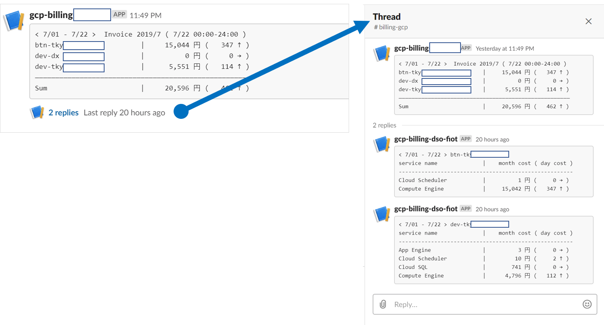

# gbilling2slack
Slack notifications tools for Google Cloud Platform Billing. 


## Overview

This package notifies gcp billing to your slack channel.

* Cloud Scheduler sends message to Cloud Pub/Sub and Cloud Pub/Sub triggers Cloud Functions. 
* Cloud Functions gets billing from BigQuery table and sends it to your Slack channel.
* You can see billing on Slack channel.

## Requirements

*Notify GCP Billing to Slack* requires the following to run:

* [Go](https://golang.org/dl/) more than 1.11
* [Cloud SDK](https://cloud.google.com/sdk/install/)

## Variables

*Notify GCP Billing to Slack* requires only 3 variables to run:

|#  |variables       |Note                             |
|---|----------------|---------------------------------|
| 1 |TABLE_NAME      |Table name of billing on BigQuery|
| 2 |SLACK_API_TOKEN |Slack api token                  |
| 3 |SLACK_CHANNEL   |Slack channel name               |


## Usage

This package uses below services.

- Google Cloud Billing（BigQuery）
- Google Cloud Functions
- Google Cloud Pub/Sub
- Google Cloud Scheduler
- Slack API


## Steps

1. [Get Slack API Token](https://get.slack.help/hc/en-us/articles/215770388-Create-and-regenerate-API-tokens)
2. Export your GCP billing to BigQuery ([reference](https://cloud.google.com/billing/docs/how-to/export-data-bigquery))
3. Set Cloud Scheduler
```sh
gcloud beta scheduler jobs create pubsub notify-billing-to-slack --project <YOUR GCP PROJECT> \
  --schedule "55 23 * * *" \
  --topic topic-billing \
  --message-body="execute" \
  --time-zone "Asia/Tokyo" \
  --description "This job invokes cloud function via cloud pubsub and send GCP billing to slack"
```
4. Deploy to Cloud Functions
```sh
gcloud functions deploy notifyBilling --project <YOUR GCP PROJECT> \
  --entry-point NotifyBilling \
  --trigger-resource topic-billing \
  --trigger-event google.pubsub.topic.publish \
  --runtime go111 \
  --set-env-vars TABLE_NAME=<billing table-name> \
  --set-env-vars SLACK_API_TOKEN=<slack-api-token> \
  --set-env-vars SLACK_CHANNEL=<slack-channel-name>
```
5. Go to the [Cloud Scheduler page](https://cloud.google.com/scheduler/docs/tut-pub-sub) and click the *run now* button of *notify-billing-to-slack*


## Example

You can get below output on slack when it comes to the set time.

This automatically notify you of charges for all services charged on GCP.





## License

This project is licensed under the Apache License 2.0 License - see the [LICENSE](LICENSE) file for details
